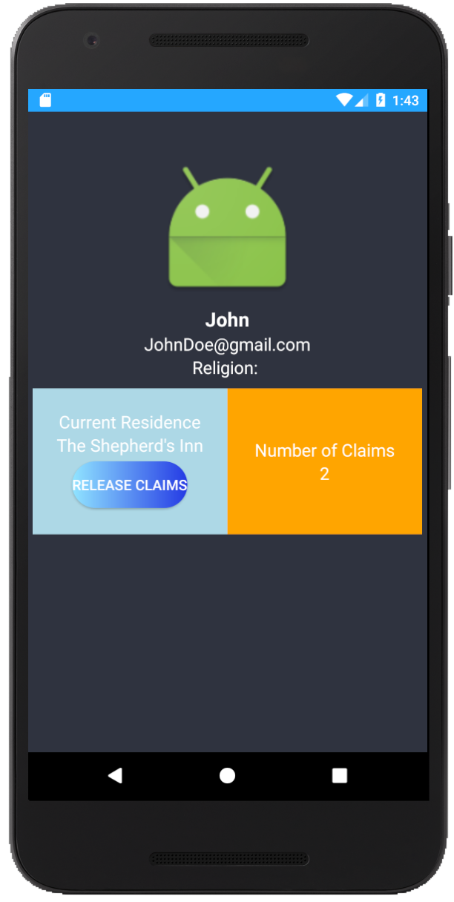
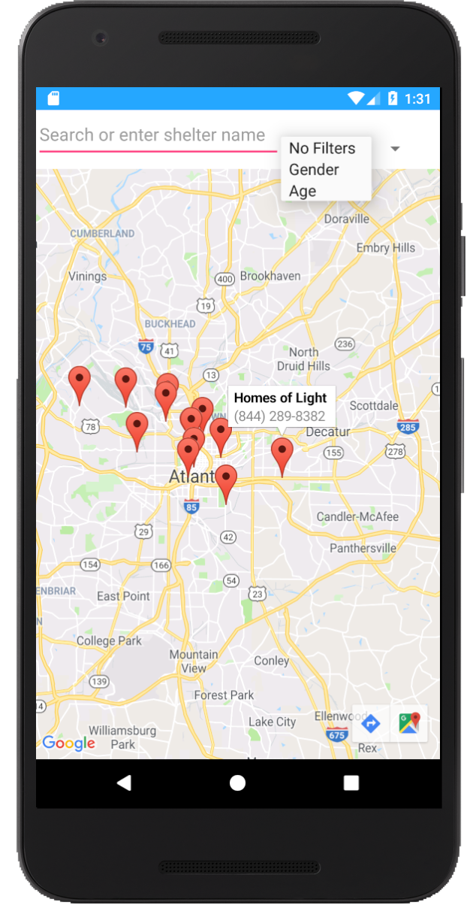
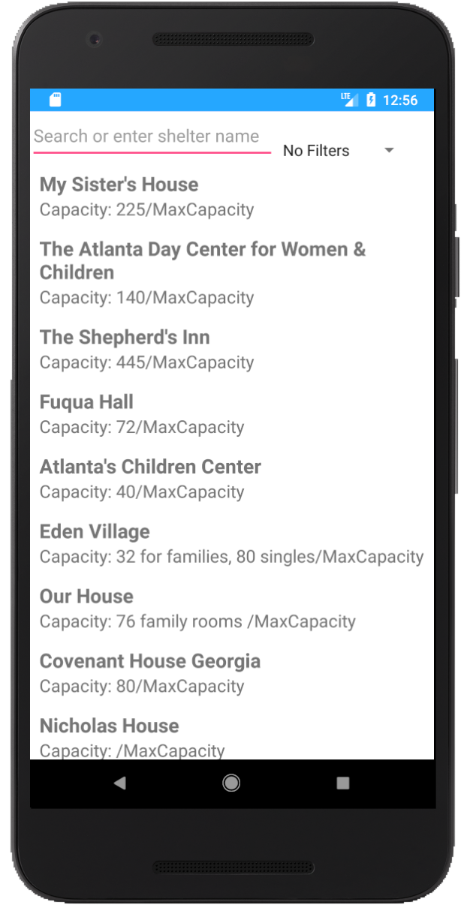

# Buzz Shelter
### Description
Teamed up with Social Good to build an android application that allows the homeless community to locate the nearest homeless shelter in accordance to their preferential needs. 

### Contributions
* Kee-Bum Phiri
  * Worked on front-end/back-end functionality
  * Integrated Google Firebase for real-time database and backend interaction among multiple devices
  * Implemented Google Maps API into application to display shelters 
* Bianca Guerrero
  * UI/UX designer
  * Worked on front-end functionality
* Yuri Ahn
  * Worked on front-end functionality
* Eugene Ahn
* David Lim
  

